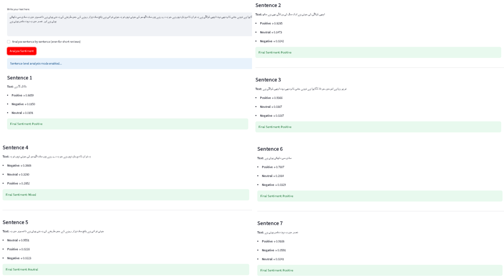

# Urdu + Roman Urdu Sentiment Analysis  

## Overview  
This project provides a **sentiment analysis application** built with **Streamlit** and a **fine-tuned transformer model**.  
It supports both **Urdu** and **Roman Urdu** text and classifies user input into **Positive, Neutral, or Negative** sentiments.  

The app is designed to:  
- Help businesses analyze **customer reviews** in Urdu/Roman Urdu.  
- Enable researchers and developers to experiment with **low-resource NLP** tasks.  
- Provide a clean, interactive UI for quick insights.  

---

## Live Demo  
👉 [Try the App here](https://sentiment-analysis-urdu-qknxhruwdscwtc3j5eu6tl.streamlit.app/)  

---

## Features  
- ✅ Handles **Urdu + Roman Urdu** text input  
- ✅ **Sentence-level breakdown** for long reviews  
- ✅ **Automatic text splitting** (long text → smaller chunks)  
- ✅ **Visual sentiment charts** (compact bar plots with highlighted scores)  
- ✅ Shows both **detailed per-sentence results** and **overall sentiment summary**  
- ✅ Built with **Hugging Face Transformers** + **Streamlit**  

---

## Project Structure 
urdu-roman-sentiment-analysis
│
├── app.py # Streamlit app 
├── requirements.txt # Dependencies 
├── notebooks/ # Jupyter notebooks (model training & evaluation) 
├── screenshots/ # UI screenshots 
└── README.md # Documentation 

---

## Dataset  
The dataset used contains **Urdu and Roman Urdu reviews**, collected from multiple real sources such as e-commerce product reviews and social media comments.  

- **Languages:** Urdu + Roman Urdu  
- **Labels:** Positive / Neutral / Negative  
- **Preprocessing:** Cleaning, normalization, and train/test splitting  

data is shared in multiple files.
---

## Model Information  
- **Base model:** `bert-base-multilingual-cased` (Hugging Face)  
- **Fine-tuned on:** Custom Urdu + Roman Urdu dataset  
- **Task:** Text Classification (3 labels: Positive, Neutral, Negative)  
- **Hosted on Hugging Face Hub:**  
  👉 [`Zeeshan7866/sentiment_analysis_model`](https://huggingface.co/Zeeshan7866/sentiment_analysis_model)  

### Screenshots
### 1. Homepage  
  

### 2. Short Review Analysis  
  

### 3. Long Review Analysis (Sentence-Level)  
  

### 4. Overall Sentiment Summary  
  

---

### Installation & Usage
#### 1. Clone Repository
```
git clone https://github.com/zeeshan-akram-ds/sentiment-analysis_urdu.git
cd sentiment-analysis_urdu
```
#### 2. Install Dependencies
```
pip install -r requirements.txt
```
#### 3. Run the App
```
streamlit run app.py
```
### Deployment

This app is ready to deploy on:

- *Streamlit Community Cloud*

- *Hugging Face Spaces*

- *Heroku / Render / Docker*
---
### Contributing

Contributions are welcome! Please:

- Fork the repo

- Create a new branch (feature-xyz)

- Commit changes

- Submit a Pull Request
---
### License

This project is licensed under the MIT License – free to use and modify.
---
### Author

**Zeeshan Akram**

- Data Science Enthusiast

- [GitHub Profile](https://github.com/zeeshan-akram-ds)

- [Hugging Face Profile](https://huggingface.co/Zeeshan7866)
---
- This project bridges the gap in sentiment analysis for low-resource languages like Urdu & Roman Urdu, empowering businesses, researchers, and developers to leverage NLP insights effectively.
